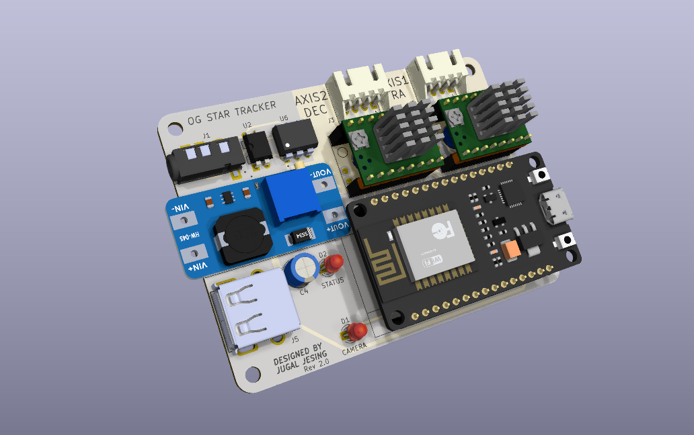
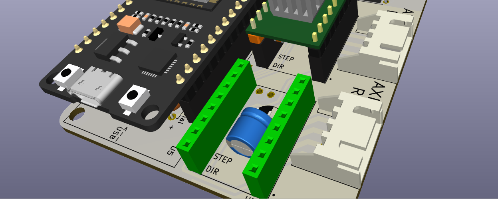

# OG Star Tracker : Wireless Control Hardware (Rev 2.0)

This simple PCB and firmware intends to make it easier to control the OG Star Tracker. If you have any suggestions/ideas about new features or would like to contribute, post in the OG star tracker [discord server](https://discord.com/invite/dyFKm79gKJ) or message me (Discord: jahh#8924).
If you like this work, feel free to connect with me on [Github](https://github.com/jugal2001) or [Linkedin](https://www.linkedin.com/in/jugaljesing/).
### Features:
- Wirelessly Control the tracker from your phone/laptop by connecting to a webpage
- Supports AP (Access Point) and STA (Station) mode
 -- AP  : The ESP32 will create a wifi network which you can connect to
 -- STA : The ESP32 connects to an existing wifi network specified by you, Ex: phone hotspot. (Not fully tested)
- Integrated intervalometer which can control your camera shutter, no need to buy extra hardware. Exposures can be controlled via the webpage
- USB port to power a Dew Heater
- Slewing supported at different speeds. 

*If you would like to buy an assembled PCB, contact Ondra Gejdos in the discord server (Creator of the OGST). Alternatively, if you live in India contact me to buy the PCB.*

Below is list of all parts if you want to assemble it yourself.
### Part list:
| Symbol        | Component             | Quantity | Example |
|:-:            |:-:                    |:-:       |  ----   |
| C1 , C2 , C4  | 100uF 6.3mm Electrolytic Capacitor (THT)| 3 | https://www.sunrom.com/p/100uf-35v-63mm-samwha|
| D1 , D2       | 3mm Red LED THT       |   2      | https://evelta.com/3-mm-red-led/ |
| J2 , J3       | 4-pin JST XH2.54mm Socket (90 degree) |   2       | https://www.sunrom.com/p/4-pin-jst-xh-25mm-side-entry-header  |
| J4            | 2.5mm Audio Jack      |   1      | https://evelta.com/2-5mm-female-audio-jack-connector-3pin/|
| J5            | USB-A Receptacle      |   1      | https://www.sunrom.com/p/usb-a-type-female-pcb-ra-short-body |
| R1 , R2       | 1.2K ohm THT Resistor |   2      | https://evelta.com/1-2k-ohm-resistance-pack-1-4-watt/|
| R3            |  68 ohm THT Resistor  |   1      | ^ |
| U1            | MT3608 Boost converter with USB |  1     |https://www.amazon.in/CENTIoT-MT3608-Adjustable-Module-Boost/dp/B07L6857QN|
| U2            | PC817 Optocoupler     |   1     | https://www.sunrom.com/p/pc817-low-voltage-high-density-optocoupler|
| U3            | TMC2209 Stepper Driver|   1     | https://robu.in/product/tmc2209-v3-0-stepper-motor-driver-module/ |
| U5            | ESP32 Devkit V1 (30 pin)|  1    | https://www.electronicscomp.com/esp32-development-board-with-wifi-bluetooth-india|
| -             | Female header pins    | 2 strips (40x1) | https://www.sunrom.com/p/254mm-40x1-female-straight-header-strip|

### Note:
1. **J1** is a footprint for a 3.5mm audio socket, use this only if you cant find the correct 2.5mm part, or if your camera has a 3.5mm port. [Example](https://robu.in/product/smartelex-audio-jack-3-5mm-trrs-smd/) 
2. **U6** is an optional footprint for a 6pin optocoupler in case you cant find a PC817. [MCT2E](https://projectpoint.in/datasheets/pdf/mct2e.pdf). Use only 1 of them.
3. **J5** USB-A Receptacle can be used to power a USB dew heater, dont solder this part if you dont plan to use a dew heater with this board.
4. **C3** is a ceramic cap connected to 3.3V-GND of the ESP32, no need to use this for now.

### Assembly:
- Here is what the fully assembled board is supposed to look like: (Use only 1 TMC2209 for now, only RA axis)

- Use female header pins to mount the TCM2209 drivers and the ESP32 so that they can be replaced easily
- The capacitors underneath the TMC2209 drivers need to be bent by 90-degree and rest on the PCB horizontally as shown:

- Keep the LED at sufficient height so that they can poke through the holes in top surface of the PCB enclosure
